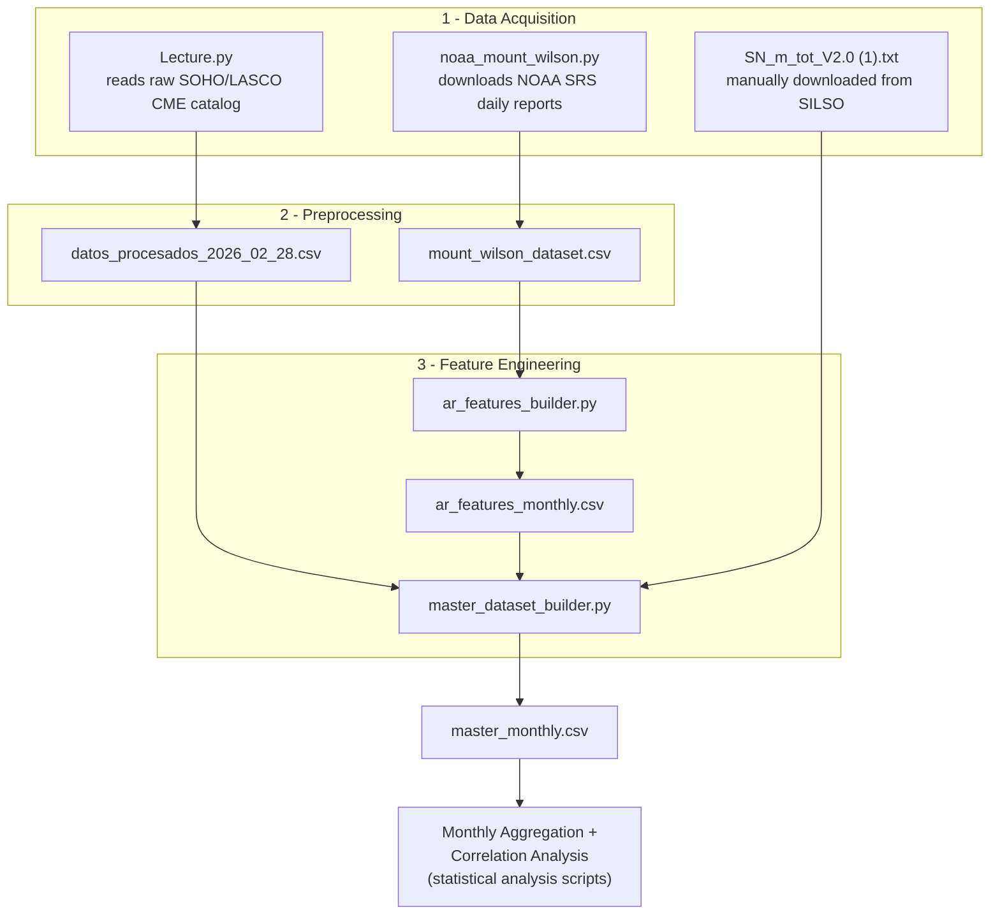

# Data Directory

This folder documents the datasets and processing scripts used in the CME (Coronal Mass Ejection) annual and monthly forecasting project. It covers data acquisition, preprocessing, and feature engineering for both CME and solar Active Region (AR) data, resulting in a monthly master dataset used downstream in statistical analysis.

---

## Pipeline Overview

The project workflow follows five stages:

1. **Data Acquisition** — retrieve raw CME and Active Region data from their public sources.
2. **Data Preprocessing** — clean, parse, and standardize each raw source independently.
3. **Feature Engineering** — derive CME subpopulations and AR-based variables, then merge everything into a single master dataset.
4. **Monthly Aggregation** — aggregate the master dataset into monthly counts per CME subpopulation and AR category.
5. **Correlation Analysis** — Spearman correlation, solar-cycle phase analysis, and lag analysis between CME activity and AR activity.

**Only stages 1–3 are implemented by the scripts documented in this folder.** Their combined output, `master_monthly.csv`, is the entry point for stages 4–5, which are carried out by the statistical analysis scripts (outside the scope of this data directory).

### Execution order



### Step-by-step

| Order | Script | Input | Output | Notes |
|---|---|---|---|---|
| 1 | `Lecture.py` | Raw SOHO/LASCO CME catalog | `datos_procesados_2026_02_28.csv` | Independent of step 2; can be run in parallel. |
| 2 | `noaa_mount_wilson.py` | NOAA SRS daily reports (downloaded automatically) | `mount_wilson_dataset.csv` | Independent of step 1; can be run in parallel. Downloads are cached in `srs_cache/`, so re-running is fast. |
| 3 | `ar_features_builder.py` | `mount_wilson_dataset.csv` | `ar_features_annual.csv`, `ar_features_monthly.csv`, `ar_features_weekly.csv` | Requires the output of step 2. |
| 4 | *(manual download)* | — | `SN_m_tot_V2.0 (1).txt` | Download from SILSO (see [Sunspot Data](#sunspot-data)) and place it in the project directory before running step 5. |
| 5 | `master_dataset_builder.py` | `datos_procesados_2026_02_28.csv`, `ar_features_monthly.csv`, `SN_m_tot_V2.0 (1).txt` | `master_monthly.csv` | Requires the outputs of steps 1, 3, and 4. This is the final dataset used by the statistical analysis scripts. |

```bash
# Step 1 and 2 can run in either order, or in parallel
python Lecture.py
python noaa_mount_wilson.py --start 1996-01-01 --end 2026-02-28

# Step 3 depends on step 2's output
python ar_features_builder_period_en.py --input mount_wilson_dataset.csv --start 1996-01 --end 2026-02

# Step 4: download SN_m_tot_V2.0 (1).txt manually from SILSO and place it in the project directory

# Step 5 depends on the outputs of steps 1, 3, and 4
python master_dataset_builder_en.py
```

---

## Included Datasets

| File | Produced by | Description |
|---|---|---|
| `datos_procesados_2026_02_28.csv` | `Lecture.py` | Cleaned CME events derived from the SOHO/LASCO CME catalog. |
| `mount_wilson_dataset.csv` | `noaa_mount_wilson.py` | One row per active region detected each day, with its Mount Wilson magnetic classification. |
| `ar_features_monthly.csv` (and `_annual` / `_weekly`) | `ar_features_builder.py` | One row per period (year / calendar month / ISO week), reindexed to the full date range, with AR-derived features (region counts, complexity, persistence). |
| `master_monthly.csv` | `master_dataset_builder.py` | Final monthly dataset combining CME counts (`datos_procesados_2026_02_28.csv`), AR features (`ar_features_monthly.csv`), and sunspot numbers. Used as input for the statistical analysis scripts. |

The CME dataset is lightweight (~3 MB) and is included to allow direct reproducibility of the analysis.

### Column language

Column names in the CME dataset are kept in Spanish to match the original processing pipeline:

- `Fecha` — CME occurrence date
- `Rapidez` — CME linear speed (km/s)
- `Ancho` — angular width (degrees)
- `Central` — central position angle (degrees)

---

## Data Sources

**CME data:** [SOHO/LASCO CME Catalog](https://cdaw.gsfc.nasa.gov/CME_list/)

**Active Region data:** [NOAA/NGDC — Solar Region Summaries](https://www.ngdc.noaa.gov/stp/space-weather/swpc-products/daily_reports/solar_region_summaries/)

### Sunspot Data

Sunspot numbers are **not included** in this repository and must be downloaded separately from:

**SILSO — Royal Observatory of Belgium**
https://www.sidc.be/silso/

Download the monthly total sunspot number file (`SN_m_tot_V2.0`) and place it in the project directory — `master_dataset_builder.py` reads it automatically once present.

---

## Scripts

### `Lecture.py`

Reads and cleans the raw SOHO/LASCO CME catalog:

- Reads the raw CME catalog file.
- Extracts the relevant columns.
- Converts dates to standard datetime format.
- Removes invalid or incomplete entries.
- Converts numeric columns to the correct type.
- Exports the cleaned dataset to `datos_procesados_2026_02_28.csv`.

---

### `noaa_mount_wilson.py`

**Data source:** [NOAA/NGDC — Solar Region Summaries](https://www.ngdc.noaa.gov/stp/space-weather/swpc-products/daily_reports/solar_region_summaries/)

**What it does:**

1. **Downloads** the daily `.txt` files from NOAA for a configurable date range, using a local cache to avoid re-downloading.
2. **Parses** each file, locating the *"I. Regions with Sunspots"* section and extracting the tabular data for each region using regular expressions.
3. **Normalizes** the Mount Wilson magnetic classification (Alpha, Beta, Beta-Gamma, Beta-Gamma-Delta, etc.) into a standard format (α, β, βγ, βγδ...) and assigns it an ordinal complexity value.
4. **Builds** a detailed dataset (one row per active region per day) and a daily aggregated summary.
5. **Exports** both results to CSV and prints descriptive statistics to the console.

**Generated datasets:**

| File | Description |
|---|---|
| `mount_wilson_dataset.csv` | Detailed dataset: one row per active region detected each day. |
| `mount_wilson_summary.csv` | Daily summary: aggregated counts and complexity per date. |

**Columns in `mount_wilson_dataset.csv`:**

| Column | Description |
|---|---|
| `date` | Report date (YYYY-MM-DD) |
| `noaa_number` | NOAA number of the active region |
| `location` | Heliographic position (e.g. N14E23) |
| `lo` | Carrington longitude |
| `area` | Area in millionths of the solar disk |
| `z_class` | Modified Zurich classification (McIntosh) |
| `ll` | Longitudinal extent (degrees) |
| `nn` | Number of sunspots |
| `mag_type_raw` | Magnetic type as it appears in the original report |
| `mag_type` | Normalized magnetic type (α, β, βγ, βγδ...) |
| `complexity` | Ordinal complexity value (1–5) |

**Mount Wilson complexity scale:**

| Type | Value |
|---|---|
| α (Alpha) | 1 |
| β (Beta) | 2 |
| βδ (Beta-Delta) | 3 |
| βγ (Beta-Gamma) / γ (Gamma) | 4 |
| γδ (Gamma-Delta) / βγδ (Beta-Gamma-Delta) | 5 |

**Main components:**

- `normalize_mag_type()` — normalizes the raw magnetic type text into the canonical format and its complexity value.
- `download_srs()` — downloads (or reads from cache) the SRS file for a given date, with retries and HTTP error handling.
- `parse_srs()` — extracts records from the "Regions with Sunspots" section using regex over fixed-width columns.
- `build_dataset()` — orchestrates the download and parsing process for the entire date range, returning a pandas `DataFrame`.
- `build_summary()` — groups by date and computes aggregated metrics (active regions, max/mean complexity, counts by type).

**Usage:**

```bash
python noaa_mount_wilson.py --start 2010-01-01 --end 2025-12-31 \
    --output mount_wilson_dataset.csv \
    --summary mount_wilson_summary.csv
```

| Argument | Description | Default value |
|---|---|---|
| `--start` | Start date (YYYY-MM-DD) | `2010-01-01` |
| `--end` | End date (YYYY-MM-DD) | `2025-12-31` |
| `--output` | Path for the detailed dataset CSV | `mount_wilson_dataset.csv` |
| `--summary` | Path for the daily summary CSV | `mount_wilson_summary.csv` |

---

### `ar_features_builder.py` — Period-based Mount Wilson Complexity Features

Builds aggregated features (annual, monthly, weekly) from `mount_wilson_dataset.csv`. For each period, every active region (AR) is represented once, using its **peak complexity** within that period — avoiding double-counting from multiple daily observations of the same region.

**What it does:**

1. **Loads** `mount_wilson_dataset.csv` and computes, for each active region (`noaa_number`), its **persistence** (`persistence_days`) — the number of days between its first and last appearance in the dataset.
2. **Classifies** each region by lifetime (`size_class`): `ephemeral`, `small`, `large`.
3. Flags regions of **high complexity** (≥ 4) and computes `complexity × area` per daily observation.
4. Creates period columns: `year`, `yearmonth`, `yearweek`.
5. **Aggregates** by period, using each region's **peak complexity** within that period: `n_total`, `n_high_complexity`, `complexity_area_sum`, `n_large`, `n_small`, `n_ephemeral`.
6. **Reindexes** monthly and weekly results to the full configured date range, filling periods with no active regions (deep solar minima) with zeros instead of leaving them absent.
7. Runs a **consistency check**: `n_large + n_small + n_ephemeral == n_total` for every year.
8. Saves `ar_features_annual.csv`, `ar_features_monthly.csv`, and `ar_features_weekly.csv`.

**Generated datasets:**

| File | Granularity |
|---|---|
| `ar_features_annual.csv` | One row per year |
| `ar_features_monthly.csv` | One row per calendar month, reindexed to the full date range |
| `ar_features_weekly.csv` | One row per ISO week, reindexed to the full date range |

**Columns:**

| Column | Description |
|---|---|
| `year` / `yearmonth` / `yearweek` | Period identifier |
| `n_total` | Unique active regions in the period |
| `n_high_complexity` | Regions whose **peak** complexity in the period was ≥ `HIGH_COMPLEXITY` (default 4: βγ, γ, γδ, βγδ) |
| `complexity_area_sum` | Sum of `complexity × area` across all daily observations in the period |
| `n_large` | Regions with persistence ≥ `THRESH_LARGE` days |
| `n_small` | Regions with persistence between `THRESH_EPHEMERAL` and `THRESH_LARGE` days |
| `n_ephemeral` | Regions with persistence ≤ `THRESH_EPHEMERAL` day |

**Configuration:**

| Constant | Description | Default |
|---|---|---|
| `THRESH_EPHEMERAL` | Max persistence (days) to classify a region as `ephemeral` | `1` |
| `THRESH_LARGE` | Min persistence (days) to classify a region as `large` | `7` |
| `HIGH_COMPLEXITY` | Complexity threshold for "high complexity" (βγ, γ, γδ, βγδ) | `4` |
| `DEFAULT_START_DATE` / `DEFAULT_END_DATE` | Full date range used to reindex monthly/weekly outputs | `1996-01` / `2026-02` |

**Usage:**

```bash
python ar_features_builder_period_en.py \
    --input mount_wilson_dataset.csv \
    --start 1996-01 --end 2026-02 \
    --outdir ./features
```

| Argument | Description | Default |
|---|---|---|
| `--input` | Path to the input dataset | `mount_wilson_dataset.csv` |
| `--start` | Start of the reindexing range (YYYY-MM) | `1996-01` |
| `--end` | End of the reindexing range (YYYY-MM) | `2026-02` |
| `--outdir` | Output directory for the generated CSV files | current directory |

---

### `master_dataset_builder.py` — Monthly Resolution

Combines the three preceding sources — CMEs, sunspot numbers, and AR features — into a single monthly master dataset.

**What it does:**

1. **Loads sunspot numbers** (`load_sunspots`): reads the whitespace-separated SIDC text file, builds a `yearmonth` (YYYY-MM) column, filters to the configured year range, and replaces the SIDC missing-data marker (`-1`) with `NaN`.
2. **Loads and filters CMEs** (`load_cmes`): reads the CME catalog and builds several monthly count columns:
   - By angular width: normal (20°–120°), partial halo (120°–<360°), full halo (360°).
   - By speed: slow (0–600 km/s), moderate (600–1000 km/s), fast (1000–1500 km/s), extreme (>1500 km/s).
   - A combined filter (`count_cmes_filtered`), using the configured `MIN_SPEED`, `MIN_WIDTH`, and `MAX_WIDTH` thresholds.
   - All monthly counts are reindexed to the full date range so months with zero CMEs show `0` rather than being absent.
3. **Loads AR features** (`load_ar_features`): reads `ar_features_monthly.csv` and normalizes the period column to `yearmonth` in `YYYY-MM` format.
4. **Builds the master dataset** (`build_master`): left-joins the three sources onto a complete monthly index spanning `YEAR_START`–`YEAR_END`, so months missing data in any one source are kept (as `NaN`) rather than dropped. CME counts are filled with `0` where no events occurred. The result is trimmed to the configured cutoff month (`END_MONTH`).
5. **Runs diagnostics** (`print_diagnostics`): reports `NaN` counts per column, verifies that all `frac_*` columns fall within `[0, 1]`, checks that `n_large + n_small + n_ephemeral == n_total`, and prints descriptive statistics.
6. **Saves** the result to `master_monthly.csv`.

**Output dataset — `master_monthly.csv` (one row per calendar month):**

| Column | Source | Description |
|---|---|---|
| `yearmonth` | — | Period (YYYY-MM) |
| `sunspot_number` | Sunspots | SIDC v2 monthly sunspot number |
| `count_cmes_all` | CMEs | Total CMEs that month (no filter) |
| `count_cmes_normal` | CMEs | CMEs with width 20°–120° |
| `count_cmes_partial_halo` | CMEs | CMEs with width 120°–<360° |
| `count_cmes_halo` | CMEs | CMEs with width == 360° (full halo) |
| `count_cmes_slow` | CMEs | CMEs with speed 0–600 km/s |
| `count_cmes_moderate` | CMEs | CMEs with speed 600–1000 km/s |
| `count_cmes_fast` | CMEs | CMEs with speed 1000–1500 km/s |
| `count_cmes_extreme` | CMEs | CMEs with speed > 1500 km/s |
| `count_cmes_filtered` | CMEs | CMEs meeting the combined speed AND width filter |
| `n_total` | AR Features | Unique active regions in the month |
| `n_high_complexity` | AR Features | ARs with peak complexity ≥ 4 (βγ, βγδ, γ, γδ) |
| `frac_high_complexity` | AR Features | `n_high_complexity / n_total` |
| `complexity_area_sum` | AR Features | Sum of `complexity × area` across all daily observations |
| `n_large` | AR Features | Long-lived ARs (≥ 7 days) |
| `n_small` | AR Features | Mid-lived ARs (2–6 days) |
| `n_ephemeral` | AR Features | Ephemeral ARs (≤ 1 day) |
| `frac_large` / `frac_small` / `frac_ephemeral` | AR Features | Respective fractions of `n_total` |

> Note: the `frac_*` and `n_high_complexity` columns are only present if they exist in the input `ar_features_monthly.csv`. Column names must match the AR Features Builder output for the merge to populate them correctly.

**Configuration:**

| Constant | Description | Default |
|---|---|---|
| `CME_FILE` | Path to the filtered CME catalog | `datos_procesados_2026_02_28.csv` |
| `SUNSPOT_FILE` | Path to the SIDC sunspot-number file | `SN_m_tot_V2.0 (1).txt` |
| `AR_FILE` | Path to the AR features CSV | `ar_features_monthly.csv` |
| `OUTPUT_FILE` | Output master CSV path | `master_monthly.csv` |
| `YEAR_START` / `YEAR_END` | Date range for the master index | `1996` / `2026` |
| `END_MONTH` | Final cutoff month for the output | `2026-02` |
| `MIN_SPEED` | Minimum CME speed (km/s) for `count_cmes_filtered` | `750` |
| `MIN_WIDTH` / `MAX_WIDTH` | Angular width range (degrees) for `count_cmes_filtered` | `120` / `360` |

**Usage:**

```bash
python master_dataset_builder_en.py
```

The script currently reads its configuration from constants at the top of the file rather than CLI arguments — edit `CME_FILE`, `SUNSPOT_FILE`, `AR_FILE`, `YEAR_START`, `YEAR_END`, `END_MONTH`, and the CME filter thresholds directly in the script before running.

**Expected input files, in the working directory:**

- `datos_procesados_2026_02_28.csv` — CME catalog with `Fecha`, `Central`, `Ancho`, `Rapidez` columns.
- `SN_m_tot_V2.0 (1).txt` — SIDC monthly sunspot-number file (whitespace-separated, no header).
- `ar_features_monthly.csv` — output of the AR Features Builder script.

---

## Reproducibility Notes

- The processed master dataset (`master_monthly.csv`) is included to ensure immediate reproducibility of the downstream statistical analysis, even without re-running steps 1–5.
- Days with no available NOAA SRS report (HTTP 404) are skipped and counted as "days with no data".
- Zero-filled periods in `ar_features_monthly.csv` / `ar_features_weekly.csv` represent real periods with no active regions (e.g., deep solar minimum), not missing data — this avoids `NaN` values when merging into the master dataset by date/period.
- CSV outputs use `csv.QUOTE_NONNUMERIC` and 4-decimal float formatting to avoid column-shifting issues in downstream parsers.
- Months with no data in a given source are kept as `NaN` in `master_monthly.csv` (not dropped), except CME counts, which are filled with `0`, since a missing month genuinely means zero events.
- CME monthly counts are reindexed to the full date range, so gaps in the raw catalog don't create missing months in the output.
- The `print_diagnostics` step in `master_dataset_builder.py` is a sanity check, not a hard validation — it prints warnings but does not stop execution if inconsistencies are found; review the printed output before using the dataset downstream.
- The by-width and by-speed CME categories are independent breakdowns (each covers all CMEs), while `count_cmes_filtered` combines both a speed and a width condition — don't sum the width or speed categories expecting them to equal `count_cmes_filtered`.
